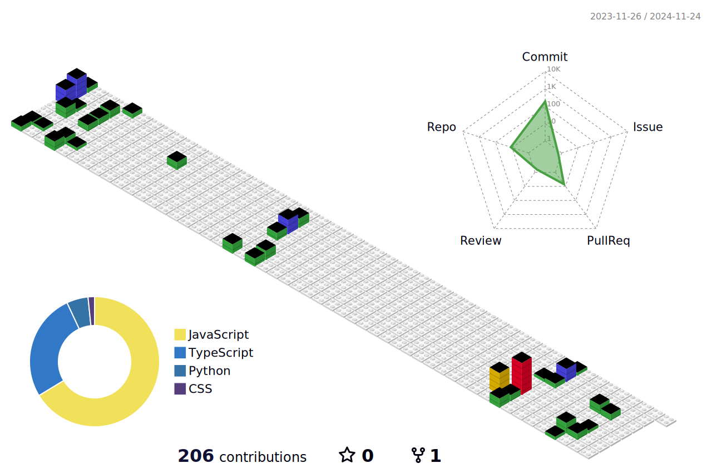

# Hi there 👋

## My name is Aleksandra (sashtje)

- 👀 I’m currently looking for a job as a **React Developer**
- 🎯 I'm **focusing** now on **React** & **Redux** & **React Native** & **Next.js** & **Node**
- 🌞 I love beautiful design & art, books, biking and travel
- ✉️ I will be **glad to collaborate** on interesting projects. Feel free to write me. See my contacts :arrow_down_small:

[**Portfolio & CV**](https://sashtje.github.io/sashtje/)

## Languages

         

  

        

  

    

  

  

## Contacts:

  

[My second GitHub as AleksaWebDev](https://github.com/AleksaWebDev)

## My activity:

