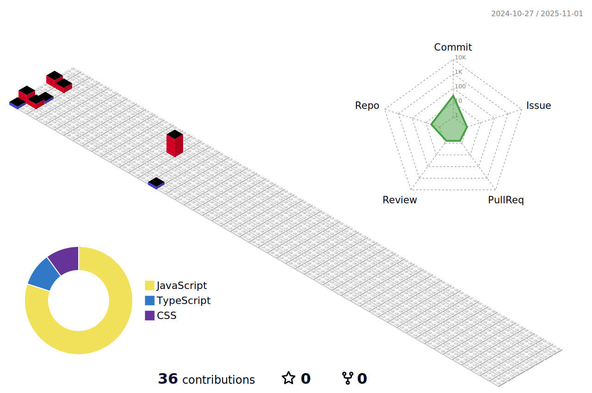

# Hi there 👋

## My name is Aleksandra (sashtje)

- 💖 I love **React** ecosystem
- 💥 I'm interested in all new front-end technologies
- 🌞 I'm fond of beautiful design & art, books, biking and travel
- ✉️ I will be **glad to collaborate** on interesting projects. Feel free to write me. See my contacts :arrow_down_small:

## Technologies

    

 

      

   

  

    

    

    

  

## Contacts:

&emsp;&emsp;

## My activity:

  

